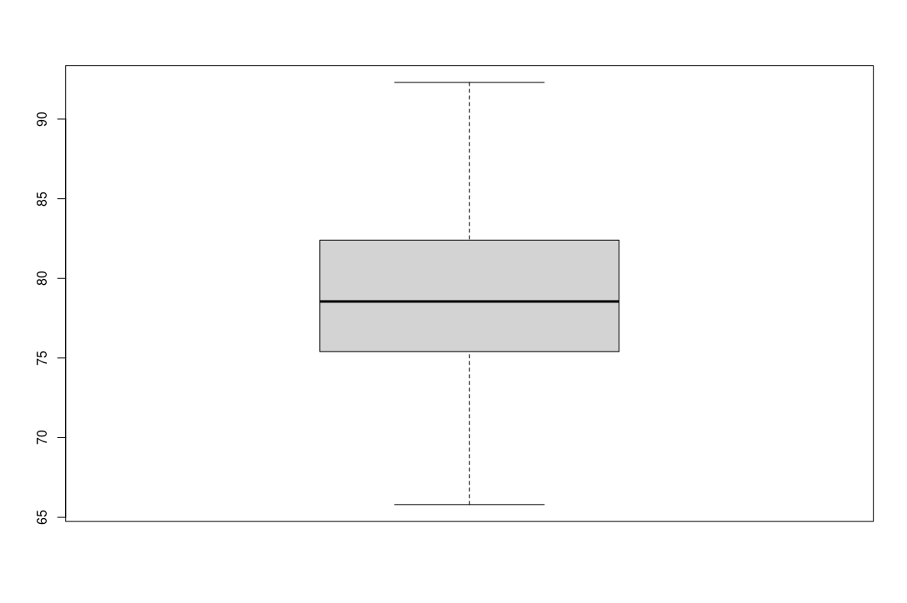
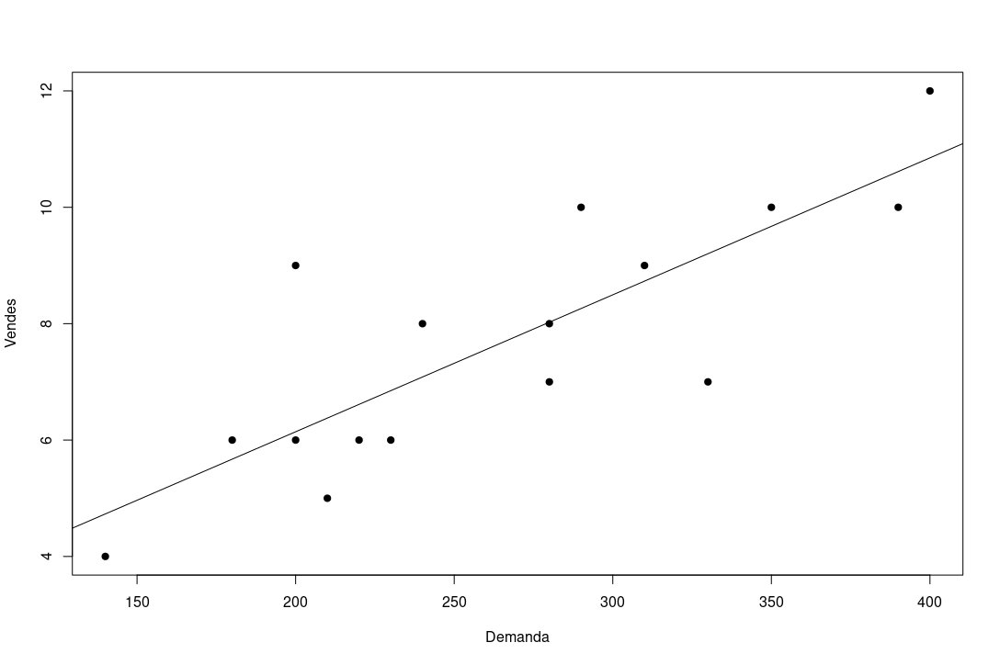
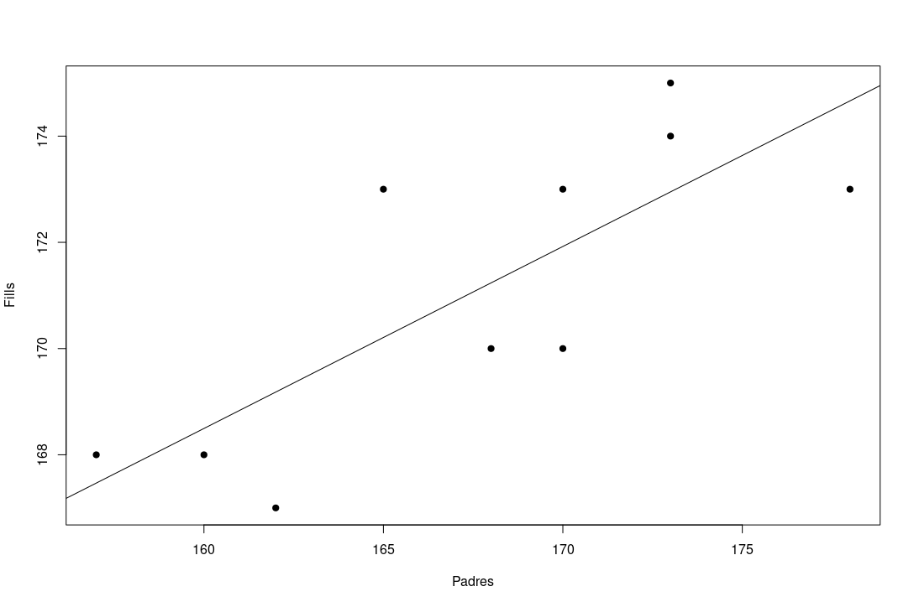

**Estadística Enginyeria Informàtica. Curs 2025-26.**

## Llista 1. Estadística Descriptiva. Solucions


#### Exercici 1

|  Fills  | Freq. abs | Freq. abs. acum. | Freq. rel. | Freq. rel. acum. |
| :-----: | :-------: | :--------------: | :--------: | :--------------: |
|  **0**  |    52     |        52        |    0.26    |     **0.26**     |
|  **1**  |    48     |       100        |  **0.24**  |       0.5        |
|  **2**  |  **45**   |       145        |   0.225    |      0.725       |
|  **3**  |    25     |     **170**      |   0.125    |       0.85       |
|  **4**  |    28     |       198        |    0.14    |     **0.99**     |
| **5++** |   **2**   |       200        |    0.1     |        1         |


#### Exercici 2

| Notes  | Freq. abs | Freq. abs. acum. | Freq. rel. | Freq. rel. acum. |
| :----: | :-------: | :--------------: | :--------: | :--------------: |
| **0**  |     4     |        4         |    0.1     |       0.1        |
| **1**  |     4     |        8         |    0.1     |       0.2        |
| **2**  |     5     |        13        |   0.125    |      0.325       |
| **3**  |     4     |        17        |    0.1     |      0.425       |
| **4**  |     6     |        23        |    0.15    |      0.575       |
| **5**  |     6     |        29        |    0.15    |      0.725       |
| **6**  |     3     |        32        |   0.075    |       0.8        |
| **7**  |     3     |        35        |   0.075    |      0.875       |
| **8**  |     3     |        38        |   0.075    |       0.95       |
| **9**  |     1     |        39        |   0.025    |      0.975       |
| **10** |     1     |        40        |   0.025    |        1         |

```R
> x <- c(7, 3, 2, 4, 5, 1, 8, 6, 1, 5, 3, 2, 4, 9, 8, 1, 0, 2, 4, 1,2, 5, 6, 5, 4, 7, 1, 3, 0, 5, 8, 6, 3, 4, 0, 10, 2, 5, 7, 4)

## b)
> mean(x)
[1] 4.075
> sd(x)*(length(x)-1)/length(x)		# Desviació típica
[1] 2.601802
> median(x)
[1] 4
```

Moda = 4 i 5.


#### Exercici 3

|  Interval   |  Marca  | Freq. abs | Freq. abs. acum. | Freq. rel. | Freq. rel. acum. |
| :---------: | :-----: | :-------: | :--------------: | :--------: | :--------------: |
|  **[0,5)**  | **2.5** |    10     |        10        |    0.32    |       0.32       |
|  **[5,7)**  |  **6**  |     8     |        18        |    0.26    |       0.58       |
| **[7,10)**  | **8.5** |     9     |        27        |    0.29    |       0.87       |
| **[10,12]** | **11**  |     4     |        31        |    0.13    |        1         |

a)	Q1 --> [0,5)
		Q2 --> [5,7)
		Q3 --> [7,10)

b) $Me= L_i+(L_{i+1}-L_i)\frac{\frac{n}{2}-N_{i-1}}{n_i}=5+(7-5)\frac{\frac{31}{2}-10}{8}=6.375$

c)	20%-percentil  --> [0,5)
		85%-percentil --> [7,10)


#### Exercici 4

```R
> stol <- c(271,428,381,366,411,193,178,178,427,180)

## a)
> sort(stol)
[1] 178 178 180 193 271 366 381 411 427 428
> median(stol)
[1] 318.5
> table(stol)
stol
178 180 193 271 366 381 411 427 428 
  2   1   1   1   1   1   1   1   1 

## b)
> var(stol); sd(stol)
[1] 12465.79
[1] 111.6503
```

c) $y_i=kx_i$

Mitjana:

$\bar{y} = \sum_{i=1}^n y_i = \sum_{i=1}^n kx_i = k\sum_{i=1}^n x_i = k\bar{x}$

Variància:

$s^2_y = \sum_{i=1}^n (y_i-\bar{y})^2 = \sum_{i=1}^n (kx_i-k\bar{x})^2 = k^2\sum_{i=1}^n (x_i-\bar{x})^2 = k^2s^2_x$

```R
> k <- 3.28084
> mean(stol)*k
[1] 988.5171
> var(stol)*k^2
[1] 134180.6

```


#### Exercici 5

```R
## a)
> # Rang
> max(temperatura)-min(temperatura)
[1] 26.5
> # Rang interquantil.lic
> summary(temperatura)[5]-summary(temperatura)[2]
3rd Qu. 
  6.875
```

b)


c) Número de classes: 7

Longitud dels intervals: 4 ºC

d)

| Temper. (Marca) | Freq. abs | Freq. abs. acum. | Freq. rel. | Freq. rel. acum. |
| :-------------: | :-------: | :--------------: | :--------: | :--------------: |
|   **[65,69)**   |     1     |        1         |   0.033    |      0.033       |
|   **[69,73)**   |     5     |        6         |   0.167    |       0.2        |
|   **[73,77)**   |     4     |        10        |   0.133    |      0.333       |
|   **[77,81)**   |     7     |        17        |   0.233    |      0.566       |
|   **[81,85)**   |     8     |        25        |   0.267    |      0.833       |
|   **[85,89)**   |     3     |        28        |    0.1     |      0.933       |
|   **[89,93]**   |     2     |        30        |   0.067    |        1         |

```R
## e)
> (7/30)*3/4
[1] 0.175	# 17.5%
```


#### Exercici 6

|              | **N** | **SN** | **MSN** |      |
| :----------: | :---: | :----: | :-----: | :--: |
|  **Impur**   |  19   |   29   |   24    |  72  |
| **No impur** |  560  |  269   |   497   | 1326 |
|              |  579  |  298   |   521   | 1398 |

a) 72/1398 = 0.0515 = 5.15%

b) 579/1398 = 0.4142 = 41.42%

c) 497/1398 = 0.3555 = 35.55%

d) (29+24)/1398 = 0.0379 = 3.79%


#### Exercici 7
```R
> eritrocits <- c(4.2, 5.7, 6.1, 3.8, 4.5, 5.2, 4.6, 4.3)
> ferro <- c(33, 48, 53, 44, 41, 39, 42, 36)

## a)
> mean(eritrocits); mean(ferro)
[1] 4.8
[1] 42

## b)
> var(eritrocits); var(ferro)
[1] 0.6285714
[1] 41.14286
> sd(eritrocits); sd(ferro)
[1] 0.792825
[1] 6.41427

## c)
> # Coeficient de variació 
> coef_var(eritrocits); coef_var(ferro)
[1] 0.1651719
[1] 0.1527207


> ## d)
> cov(eritrocits,ferro)
[1] 3.6
> cor(eritrocits,ferro)
[1] 0.7079099
 
```


#### Exercici 8

a) 16 anys - Enunciat: $\texttt{dim(previsions)}$

b) Enunciat:  $\texttt{mean(...), var(...), cov(...)}$

```R
## c)
cor(Demanda, Vendes)
[1] 0.8194537
# Correlació lineal moderada positiva

## d)
> reg

Call:
lm(formula = Vendes ~ Demanda)

Coefficients:
(Intercept)      Demanda  
    1.43558      0.02354
# També es pot trobar a l'enunciat: summary(reg) - Coefficients
```


```R
## e)
> new.x <- data.frame(Demanda = c(150, 210, 380))
> predict(reg, newdata = new.x)
        1         2         3 
 4.966077  6.378275 10.379502 

## f)
# Valors ajustats
> v_ajustats <- predict(reg)
> v_ajustats[1:3]
        1         2         3 
 6.142909  6.613641 10.850235 
# Residus
> residus <- Vendes-v_ajustats
> residus[1:3]
         1          2          3 
 2.8570913 -0.6136413  1.1497654
```


#### Exercici 9

a) Enunciat:  $\texttt{mean(...), var(...), cov(...)}$

Unitats de mesura: Mitjanes g i kcal, variàncies g² i kcal², covariància g·kcal. 

```R
## b)
cor(carbohidrats, calories)
[1] 0.7247129
# Correlació lineal moderada positiva

## c)
> reg

Call:
lm(formula = calories ~ carbohidrats)

Coefficients:
 (Intercept)  carbohidrats  
       93.00         10.65  
```

Coeficient de determinació: 0.4659 --> 46.6% - Enunciat: $\texttt{Adjusted R - squared}$.

```R
## d)
> new.x <- data.frame(carbohidrats = 5)
> predict(reg, newdata = new.x)
       1 
146.2287 
```


#### Exercici 10

```R
> pares <- c(165, 160, 170, 162, 173, 157, 178, 168, 173, 170)
> fills <- c(173, 168, 173, 167, 175, 168, 173, 170, 174, 170)

> ## a)
> mean(pares); mean(fills)
[1] 167.6
[1] 171.1
> var(pares); var(fills)
[1] 42.93333
[1] 8.1
> sd(pares); sd(fills)
[1] 6.552353
[1] 2.84605

## b)
# Covariancia
> cov(pares, fills)
[1] 14.71111
# Coeficient de correlacio
> cor(pares, fills)
[1] 0.7888704
# Coeficient de determinacio
> cor(pares, fills)^2
[1] 0.6223165

## c)
> reg <- lm(fills~pares)
> reg

Call:
lm(formula = fills ~ pares)

Coefficients:
(Intercept)       pares  
   113.6718       0.3427
```


```R
## d)
> new.p <- data.frame(pares = 166)
> predict(reg, newdata = new.p)
       1 
170.5518
```


#### Exercici 11

```R
> x <- c(1, 2, 6, 3, 5, 10)
> y <- c(3.8, 8.2, 19.1, 9.5, 15, 31.1)

## a)
> reg <- lm(y~x)
> reg

Call:
lm(formula = y ~ x)

Coefficients:
(Intercept)            x  
      1.064        2.975

## b)
# Covariancia
> cov(x, y)
[1] 31.83
# Coeficient de correlacio
> cor(x, y)
[1] 0.9971597
# Coeficient de determinacio
> cor(x, y)^2
[1] 0.9943274

## c)
# Valors ajustats
> y_ajustats <- predict(reg)
> y_ajustats
        1         2         3         4         5         6 
 4.038318  7.013084 18.912150  9.987850 15.937383 30.811215 
# Residus
> residus <- y-y_ajustats
> residus
         1          2          3          4          5          6 
-0.2383178  1.1869159  0.1878505 -0.4878505 -0.9373832  0.2887850 
```
